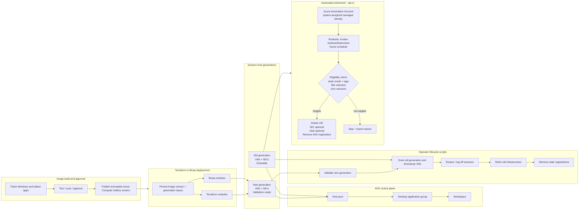

# Azure architecture diagram

```mermaid
flowchart LR
  subgraph ImagePipeline[Image build and approval]
    Build[Patch Windows and baked apps]
    Scan[Test / scan / approve]
    Gallery[Publish immutable Azure Compute Gallery version]
    Build --> Scan --> Gallery
  end

  subgraph IaC[Terraform or Bicep deployment]
    Params[Pinned image version + generation inputs]
    TF[Terraform modules]
    BP[Bicep modules]
    Params --> TF
    Params --> BP
  end

  subgraph ControlPlane[AVD control plane]
    HP[Host pool]
    DAG[Desktop application group]
    WS[Workspace]
    HP --> DAG --> WS
  end

  subgraph SessionHosts[Session host generations]
    Old[Old generation
VMs + NICs
Drainable]
    New[New generation
VMs + NICs
Validation ready]
  end

  Gallery --> IaC
  TF --> New
  BP --> New
  New --> HP
  Old --> HP

  subgraph Operations[Operator lifecycle scripts]
    Validate[Validate new generation]
    Drain[Drain old generation and timestamp VMs]
    Sessions[Review / log off sessions]
    Retire[Retire old infrastructure]
    Cleanup[Remove stale registrations]
    Validate --> Drain --> Sessions --> Retire --> Cleanup
  end

  New --> Validate
  Old --> Drain

  subgraph AutoRetirement[Automated retirement - opt-in]
    AA[Azure Automation Account
system-assigned managed identity]
    RB[Runbook: Invoke-AvdAutoRetirement
hourly schedule]
    Check{Eligibility check
drain mode + tags
30h retention
zero sessions}
    Delete[Delete VM
NIC optional
Disk optional
Remove AVD registration]
    AA --> RB --> Check
    Check -- Eligible --> Delete
    Check -- Not eligible --> Skip[Skip + report reason]
  end

  Old --> AutoRetirement
```
