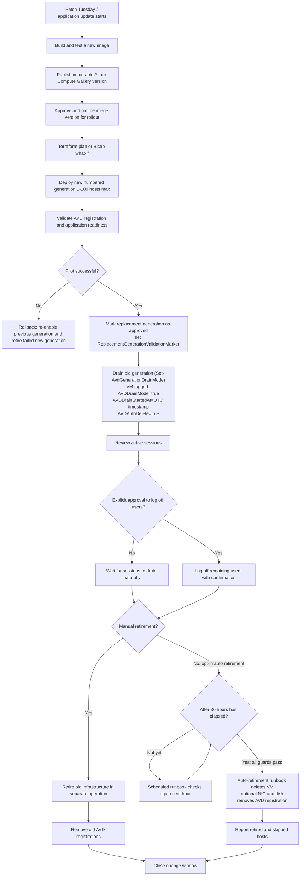

# Patch process diagram

```mermaid
flowchart TD
  A[Patch Tuesday / application update starts] --> B[Build and test a new image]
  B --> C[Publish immutable Azure Compute Gallery version]
  C --> D[Approve and pin the image version for rollout]
  D --> E[Terraform plan or Bicep what-if]
  E --> F[Deploy new numbered generation 1-100 hosts max]
  F --> G[Validate AVD registration and application readiness]
  G --> H{Pilot successful?}
  H -- No --> I[Rollback: re-enable previous generation and retire failed new generation]
  H -- Yes --> J[Mark replacement generation as approved\nset ReplacementGenerationValidationMarker]
  J --> K["Drain old generation (Set-AvdGenerationDrainMode)\nVM tagged: AVDDrainMode=true\nAVDDrainStartedAt=UTC timestamp\nAVDAutoDelete=true"]
  K --> L[Review active sessions]
  L --> M{Explicit approval to log off users?}
  M -- No --> N[Wait for sessions to drain naturally]
  M -- Yes --> O[Log off remaining users with confirmation]
  N --> P{Manual retirement?}
  O --> P
  P -- Yes --> Q[Retire old infrastructure in separate operation]
  Q --> R[Remove old AVD registrations]
  R --> S[Close change window]
  P -- No: opt-in auto retirement --> T{After 30 hours has elapsed?}
  T -- Not yet --> U[Scheduled runbook checks again next hour]
  U --> T
  T -- Yes: all guards pass --> V[Auto-retirement runbook deletes VM\noptional NIC and disk\nremoves AVD registration]
  V --> W[Report retired and skipped hosts]
  W --> S
```
